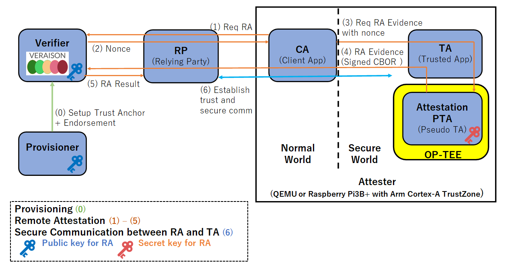

<!--
-------------------------------------------------------------------------------------------------------------------
-->
# 日本語解説 OP-TEE Remote Attestation with VERAISON Verification

このドキュメントではQEMUとDockerコンテナを用いた[OP-TEE](https://github.com/OP-TEE/optee_os) Remote Attestation 実行環境の構築と、[VERAISON](https://github.com/veraison) Verification を活用した一連の動作を確認手順を説明します。
OP-TEEはRaspberry Pi 3B+ (Arm Cortex-A TrustZone)でも動作が確認できています。

下図はプロビジョニング(0)、リモートアテステーション(1)-(5)、セキュアコミュニケーション(6)の手順を示しています。


## 前提条件

開発物を実行するには以下を満たす環境を準備する必要があります。

* Docker がインストールされていること
* Docker デーモンが稼働していること
* Docker 用に20GBのディスクが残っていること(docker system dfで確認できる)
* `jq` がインストールされていること（Ubuntu であれば、`sudo apt-get install jq`）

## 実行方法

以下の 0 から 6 の手順に従い、リモートアテステーションの一連の流れをテストしてください。

### 0. このgithubのクローン
最初にgit cloneによりoptee-raのソースを取り寄せます。
```sh
git clone https://github.com/iisec-suzaki/optee-ra
cd optee-ra
```

### 1. Veraison が提供するサービスの起動

Veraisonのソースをgithubから取り寄せます。
```sh
git clone https://github.com/veraison/services.git
cd services && git checkout b50b67d && cd ..
```
この際に下記のメッセージがでますが、問題ありません。
```
Note: switching to 'b50b67d'.

You are in 'detached HEAD' state. You can look around, make experimental
changes and commit them, and you can discard any commits you make in this
state without impacting any branches by switching back to a branch.

If you want to create a new branch to retain commits you create, you may
do so (now or later) by using -c with the switch command. Example:

  git switch -c <new-branch-name>

Or undo this operation with:

  git switch -

Turn off this advice by setting config variable advice.detachedHead to false

HEAD is now at b50b67d Merge pull request #208 from aj-stein-nist/patch-1
```

次にホストマシン上で動作させるサービスを起動します。
以下のコマンドにより、Veraison を起動することができます。起動には時間がかかります。
```sh
make -C services docker-deploy
```

サービスを起動した後、以下のコマンドで、サービスの状態を確認することができます。zsh を使っている場合、`source services/deployments/docker/env.bash` の代わりに `source services/deployments/docker/env.zsh` を実行してください。
```sh
source services/deployments/docker/env.bash
veraison status
```

正常に、Veraison のサービスが起動した場合、以下のような出力が得られます。
```txt
         vts: running
provisioning: running
verification: running
  management: running
    keycloak: running
```

### 2. Provisioning の実行

以下のコマンドで、Verifier に対して、`trust anchor` と `reference value` を登録します。これらの値は Attester から送信された evidence の検証に用いられます。登録する値を変更したい場合は `provisoning/data` 以下のファイルを改変してください。
```sh
./provisoning/run.sh
```

登録された値は以下のコマンドで確認できます。
```sh
veraison stores
```

登録が成功すると、以下のような出力が得られます。これは Verifier に登録された値を示しています。
```txt
TRUST ANCHORS:
--------------
{
  "scheme": "PSA_IOT",
  "type": "trust anchor",
  "subType": "",
  "attributes": {
    "PSA_IOT.hw-model": "RoadRunner",
    "PSA_IOT.hw-vendor": "ACME",
    "PSA_IOT.iak-pub": "-----BEGIN PUBLIC KEY-----\nMFkwEwYHKoZIzj0CAQYIKoZIzj0DAQcDQgAEMKBCTNIcKUSDii11ySs3526iDZ8A\niTo7Tu6KPAqv7D7gS2XpJFbZiItSs3m9+9Ue6GnvHw/GW2ZZaVtszggXIw==\n-----END PUBLIC KEY-----",
    "PSA_IOT.impl-id": "YWNtZS1pbXBsZW1lbnRhdGlvbi1pZC0wMDAwMDAwMDE=",
    "PSA_IOT.inst-id": "Ac7rrnuJJ6MiflMDz14PH3s0u1Qq1yUKwD+83jbsLxUI"
  }
}

ENDORSEMENTS:
-------------
{
  "scheme": "PSA_IOT",
  "type": "reference value",
  "subType": "PSA_IOT.sw-component",
  "attributes": {
    "PSA_IOT.hw-model": "RoadRunner",
    "PSA_IOT.hw-vendor": "ACME",
    "PSA_IOT.impl-id": "YWNtZS1pbXBsZW1lbnRhdGlvbi1pZC0wMDAwMDAwMDE=",
    "PSA_IOT.measurement-desc": "sha-256",
    "PSA_IOT.measurement-type": "PRoT",
    "PSA_IOT.measurement-value": "MbgFqjT4jfR+fK1O4YyQtZUYD0nhXh7GfhM0EmR6tgc=",
    "PSA_IOT.signer-id": "rLsRx+TaIXIFUjzkzhokWuGiOa48a/2eeHH35di66Gs="
  }
}
```

`TRUST ANCHORS` は Attester から送信された evidence の署名を検証するためのデータを示しています。Attester から送信される evidence には `impl-id` と `inst-id` が含まれており、Verifier は受信した evidence をどの `TRUST ANCHOR` で検証するかを識別するためにそれらを用います。Verifier は識別された署名鍵（公開鍵）を用いて、CBOR(COSE) 形式の evidence を検証します。
* `iak-pub`: evidence の署名を検証するための公開鍵（本プロジェクトでは ECDSA w/ SHA256 アルゴリズムが署名に用いられます。これは生成する evidence の形式が CBOR(COSE) であり、その仕様 [RFC 8152](https://datatracker.ietf.org/doc/html/rfc8152#section-8.1) に準拠したものです。）
* `impl-id`: Attester の ID
* `inst-id`: 公開鍵の ID

`ENDORSEMENTS` は Attester から送信された evidence の内容を検証するためのデータ（オラクル）を示しています。Attester から送信される evidence には `impl-id` と `measurment-value` が含まれており、Verifier は受信した evidence をどの `ENDORSEMENT` と比較するかを識別するために `impl-id` を用います。Verifier は識別された `ENDORSEMENT` に記録されている `measurement-value` と受信した evidence に含まれる `measurement-value` を比較して、コードハッシュ値の正しさを検証します。その他の項目やより詳細な情報は仕様 [Arm's Platform Security Architecture (PSA) Attestation Token](https://datatracker.ietf.org/doc/draft-tschofenig-rats-psa-token/) を確認してください。
* `impl-id`: Attester の ID
* `measurement-value`:　コードハッシュ値（本プロジェクトでは PTA を呼び出す TA コードの SHA256）

### 3. Relying Party の起動

次に、Relying Party を実行するためのコンテナを起動し、アプリケーションを実行します。Relying Party は、Attester からのリクエストを受け、Attester と Verifier の間の通信を仲介します。また、Verifier からアテステーション結果を受信すると、それをログに出力します。
```sh
./relying_party/container/start.sh
```

以下のコマンドで Relying Party のログは確認できます。
```sh
docker logs relying-party-service
```

正常に起動すると、以下のような出力が得られます。
```txt
go build -o rp main.go
./rp
2024/02/22 05:17:54 Relying party is starting...
```

### 4. Attester の起動

次に、アテステーションリクエストを送信する Attester を起動します。コンテナ上の QEMU の上で Attester を動作させる環境を準備しています。以下の 5 つの手順に従い、コンテナの起動し、 Verifier との通信プログラムを実行してください。

#### 4.1. コンテナの起動

以下のコマンドを実行すると、Docker コンテナ上に入ります。注意として、初期実行時にはイメージのビルドに時間がかかるため、コンテナが起動するのに数十分かかることがあります。
```sh
./attester/container/start.sh
```

#### 4.2. normal world のターミナルを開く

手順 4.1. でコンテナを起動したターミナルとは別のターミナルを開き、以下を実行してください。QEMU 上で実行する Attester の normal world に接続する用のターミナルが準備されます。
```sh
./attester/container/launch_soc_term.sh normal
```

#### 4.3. secure world のターミナルを開く

手順 4.1. と 4.2. で使用したターミナルとは別のターミナルを開き、以下を実行してください。QEMU 上で実行する Attester の secure world に接続する用のターミナルが準備されます。
```sh
./attester/container/launch_soc_term.sh secure
```

#### 4.4. ユーザが追加した CA/TA/PTA のビルドと、QEMU の起動とログイン

手順 4.1. で起動したターミナルで以下コマンドをを実行してください。以下のコマンでは `/optee/optee_os/core/pta/sub.mk` を編集し、`subdirs-y += remote_attestation` の行を追加し、追加したアプリケーションを再ビルドし、QEMUを立ち上げます。
```sh
echo "subdirs-y += remote_attestation" >> /optee/optee_os/core/pta/sub.mk
make -C ${OPTEE_DIR}/build run CFG_REMOTE_ATTESTATION_PTA=y -j
```

QEMU が立ち上がったら、c を入力します。
```sh
(qemu) c
```

次に、normal world のターミナル（2. で起動したターミナル）上で、`test` ユーザでログインします。
```sh
buildroot login: test
```

#### 4.5. プログラムの実行

プログラムは normal world のターミナル上で起動します。
開発した evidence 生成プログラムを実行する場合は、以下のコマンドで実行できます。
```sh
optee_remote_attestation
```

正しく実行できた場合、以下のような出力が noromal world のターミナルで得られます。
```txt
Opened new Veraison client session at http://relying-party-service:8087/challenge-response/v1/session/ed70cc0d-d141-11ee-9588-623338313838

Number of media types accepted: 7
	application/vnd.parallaxsecond.key-attestation.cca
	application/vnd.parallaxsecond.key-attestation.tpm
	application/pem-certificate-chain
	application/vnd.enacttrust.tpm-evidence
	application/eat-collection; profile=http://arm.com/CCA-SSD/1.0.0
	application/psa-attestation-token
	application/eat-cwt; profile=http://arm.com/psa/2.0.0

Nonce size: 32 bytes
Nonce: [0x60, 0x48, 0xbd, 0x24, 0x55, 0xdb, 0x8a, 0x4, 0x6e, 0xcc, 0x7, 0x20, 0x40, 0x26, 0x87, 0xd0, 0x60, 0x72, 0xd, 0x95, 0x45, 0x57, 0x92, 0xa5, 0x36, 0xf4, 0x84, 0x52, 0xd5, 0xee, 0x5d, 0xbe]

Completed opening the session.


Invoke TA.
Invoked TA successfully.


Received evidence of CBOR (COSE) format from PTA.

CBOR(COSE) size: 306
CBOR(COSE): d28443a10126a058e7a71901097818687474703a2f2f61726d2e636f6d2f7073612f322e302e3019095a0119095b19300019095c582061636d652d696d706c656d656e746174696f6e2d69642d30303030303030303119095f81a3016450526f5402582031b805aa34f88df47e7cad4ee18c90b595180f49e15e1ec67e133412647ab607055820acbb11c7e4da217205523ce4ce1a245ae1a239ae3c6bfd9e7871f7e5d8bae86b0a58206048bd2455db8a046ecc0720402687d060720d95455792a536f48452d5ee5dbe190100582101ceebae7b8927a3227e5303cf5e0f1f7b34bb542ad7250ac03fbcde36ec2f15085840fd39ee2aac4f64be2a58c1eca501ec1a3a7528f73bcbe8a90e7e1efda7e2cfce793fd28137c8a966793b605981fa677824867b22e21efcd6908338c4e3083b08


Supplying the generated evidence to the server.

Received the attestation result from the server.

Raw attestation result (JWT): eyJhbGciOiJFUzI1NiIsInR5cCI6IkpXVCJ9.eyJlYXIudmVyaWZpZXItaWQiOnsiYnVpbGQiOiJOL0EiLCJkZXZlbG9wZXIiOiJWZXJhaXNvbiBQcm9qZWN0In0sImVhdF9ub25jZSI6IllFaTlKRlhiaWdSdXpBY2dRQ2FIMEdCeURaVkZWNUtsTnZTRVV0WHVYYjQ9IiwiZWF0X3Byb2ZpbGUiOiJ0YWc6Z2l0aHViLmNvbSwyMDIzOnZlcmFpc29uL2VhciIsImlhdCI6MTcwODU3OTE1OSwic3VibW9kcyI6eyJQU0FfSU9UIjp7ImVhci5hcHByYWlzYWwtcG9saWN5LWlkIjoicG9saWN5OlBTQV9JT1QiLCJlYXIuc3RhdHVzIjoiYWZmaXJtaW5nIiwiZWFyLnRydXN0d29ydGhpbmVzcy12ZWN0b3IiOnsiY29uZmlndXJhdGlvbiI6MCwiZXhlY3V0YWJsZXMiOjIsImZpbGUtc3lzdGVtIjowLCJoYXJkd2FyZSI6MiwiaW5zdGFuY2UtaWRlbnRpdHkiOjIsInJ1bnRpbWUtb3BhcXVlIjoyLCJzb3VyY2VkLWRhdGEiOjAsInN0b3JhZ2Utb3BhcXVlIjoyfSwiZWFyLnZlcmFpc29uLmFubm90YXRlZC1ldmlkZW5jZSI6eyJlYXQtcHJvZmlsZSI6Imh0dHA6Ly9hcm0uY29tL3BzYS8yLjAuMCIsInBzYS1jbGllbnQtaWQiOjEsInBzYS1pbXBsZW1lbnRhdGlvbi1pZCI6IllXTnRaUzFwYlhCc1pXMWxiblJoZEdsdmJpMXBaQzB3TURBd01EQXdNREU9IiwicHNhLWluc3RhbmNlLWlkIjoiQWM3cnJudUpKNk1pZmxNRHoxNFBIM3MwdTFRcTF5VUt3RCs4M2pic0x4VUkiLCJwc2Etbm9uY2UiOiJZRWk5SkZYYmlnUnV6QWNnUUNhSDBHQnlEWlZGVjVLbE52U0VVdFh1WGI0PSIsInBzYS1zZWN1cml0eS1saWZlY3ljbGUiOjEyMjg4LCJwc2Etc29mdHdhcmUtY29tcG9uZW50cyI6W3sibWVhc3VyZW1lbnQtdHlwZSI6IlBSb1QiLCJtZWFzdXJlbWVudC12YWx1ZSI6Ik1iZ0ZxalQ0amZSK2ZLMU80WXlRdFpVWUQwbmhYaDdHZmhNMEVtUjZ0Z2M9Iiwic2lnbmVyLWlkIjoickxzUngrVGFJWElGVWp6a3pob2tXdUdpT2E0OGEvMmVlSEgzNWRpNjZHcz0ifV19fX19.PCUUBd6tyV2WdXuM07de3-ZFpKdoL-uEP7yeP1zNEJOpEJ9sVUDJkINI3nalh7nno2etEitbQABZxBCsy_6tKg

Disposing client session.

Completed sending the evidence and receiving the attestation result.
```

### 5. 検証の実行と結果の確認

以下のコマンドで、relying party のターミナルのログを確認できます。
```sh
docker logs relying-party-service
```

アテステーション結果は `ear.status` の欄に記載されており、`affirming` であれば正しいアテステーション結果が得られたことを意味しています。
```txt
2024/02/22 05:19:18 Received request: POST /challenge-response/v1/newSession?nonceSize=32
2024/02/22 05:19:18 Received response: 201 Created
2024/02/22 05:19:19 Received request: POST /challenge-response/v1/session/ed70cc0d-d141-11ee-9588-623338313838
2024/02/22 05:19:19 Received response: 200 OK
2024/02/22 05:19:19 Attestation result: >> "/tmp/1442613949.jwt" signature successfully verified using "pkey.json"
[claims-set]
{
    "ear.verifier-id": {
        "build": "N/A",
        "developer": "Veraison Project"
    },
    "eat_nonce": "YEi9JFXbigRuzAcgQCaH0GByDZVFV5KlNvSEUtXuXb4=",
    "eat_profile": "tag:github.com,2023:veraison/ear",
    "iat": 1708579159,
    "submods": {
        "PSA_IOT": {
            "ear.appraisal-policy-id": "policy:PSA_IOT",
            "ear.status": "affirming",
            "ear.trustworthiness-vector": {
                "configuration": 0,
                "executables": 2,
                "file-system": 0,
                "hardware": 2,
                "instance-identity": 2,
                "runtime-opaque": 2,
                "sourced-data": 0,
                "storage-opaque": 2
            },
            "ear.veraison.annotated-evidence": {
                "eat-profile": "http://arm.com/psa/2.0.0",
                "psa-client-id": 1,
                "psa-implementation-id": "YWNtZS1pbXBsZW1lbnRhdGlvbi1pZC0wMDAwMDAwMDE=",
                "psa-instance-id": "Ac7rrnuJJ6MiflMDz14PH3s0u1Qq1yUKwD+83jbsLxUI",
                "psa-nonce": "YEi9JFXbigRuzAcgQCaH0GByDZVFV5KlNvSEUtXuXb4=",
                "psa-security-lifecycle": 12288,
                "psa-software-components": [
                    {
                        "measurement-type": "PRoT",
                        "measurement-value": "MbgFqjT4jfR+fK1O4YyQtZUYD0nhXh7GfhM0EmR6tgc=",
                        "signer-id": "rLsRx+TaIXIFUjzkzhokWuGiOa48a/2eeHH35di66Gs="
                    }
                ]
            }
        }
    }
}
[trustworthiness vectors]
submod(PSA_IOT):
Instance Identity [affirming]: The Attesting Environment is recognized, and the associated instance of the Attester is not known to be compromised.
Configuration [none]: The Evidence received is insufficient to make a conclusion.
Executables [affirming]: Only a recognized genuine set of approved executables, scripts, files, and/or objects have been loaded during and after the boot process.
File System [none]: The Evidence received is insufficient to make a conclusion.
Hardware [affirming]: An Attester has passed its hardware and/or firmware verifications needed to demonstrate that these are genuine/supported.
Runtime Opaque [affirming]: the Attester's executing Target Environment and Attesting Environments are encrypted and within Trusted Execution Environment(s) opaque to the operating system, virtual machine manager, and peer applications.
Storage Opaque [affirming]: the Attester encrypts all secrets in persistent storage via using keys which are never visible outside an HSM or the Trusted Execution Environment hardware.
Sourced Data [none]: The Evidence received is insufficient to make a conclusion.
```

### 6. 異なる TA からアテステーションリクエストを送信するシナリオ

ここまでで、リモートアテステーションが成功する一連の流れを確認しました。次に、異なる TA からアテステーションリクエストを送った際に失敗するシナリオと、新たな endorsment を登録することでアテステーションが成功されるシナリオを確認します。

#### 6.1. 登録されていない TA からのアテステーションリクエスト

はじめに、録されてない TA から PTA にリクエストを送り、リモートアテステーションが失敗する流れを確認します。例えば、以下のように [`attester/remote_attestation/ta/include/remote_attestation_ta.h`](attester/remote_attestation/ta/include/remote_attestation_ta.h) の `IMPLEMENTATION_ID` を書き換えると、TA のコードハッシュと implementation ID が変わり、PTA が生成する CBOR(COSE) evidence の内容が変わります。これにより、provisioning されているデータと異なるので、アテステーションが失敗するはずです。
```c
diff --git a/attester/remote_attestation/ta/include/remote_attestation_ta.h b/attester/remote_attestation/ta/include/remote_attestation_ta.h
index 4380753..d9cad98 100644
--- a/attester/remote_attestation/ta/include/remote_attestation_ta.h
+++ b/attester/remote_attestation/ta/include/remote_attestation_ta.h
@@ -16,7 +16,7 @@
 #define TA_REMOTE_ATTESTATOIN_CMD_GEN_CBOR_EVIDENCE 0
 
 /* Implementation ID used in PSA evidence */
-#define IMPLEMENTATION_ID     "acme-implementation-id-000000001"
+#define IMPLEMENTATION_ID     "acme-implementation-id-000000002"
 #define IMPLEMENTATION_ID_LEN 32
 
 #if defined(HOST_BUILD)
```

実際に、コードを書き換えた後にアテステーションリクエストを送信してみます。手順 4.4. で QEMU を起動したターミナルで `ctrl+c` をして、一度 QEMU を終了します。その後、もう一度手順 4.4 に従い、TA の再ビルド・QEMU の再起動をします（`echo` コマンドで `subdirs-y += remote_attestation` の行を追加するコマンドを再実行する必要はないです）。

その後、手順 4.5. に従い、アテステーションリクエストを送り、手順 5. に従い結果を確認すると、以下のようなアテステーション結果が得られます。`"ear.status": "contraindicated"` になっており、アテステーションに失敗していることがわかります。 
```txt
2024/02/22 05:36:19 Received request: POST /challenge-response/v1/newSession?nonceSize=32
2024/02/22 05:36:19 Received response: 201 Created
2024/02/22 05:36:20 Received request: POST /challenge-response/v1/session/4e2f256e-d144-11ee-9588-623338313838
2024/02/22 05:36:20 Received response: 200 OK
2024/02/22 05:36:20 Attestation result: >> "/tmp/3383640462.jwt" signature successfully verified using "pkey.json"
[claims-set]
{
    "ear.verifier-id": {
        "build": "commit-b50b67d",
        "developer": "Veraison Project"
    },
    "eat_nonce": "J5um9vO4NYv8hYqPXUWsYuuWgW0TLV0qoZGQk3EnIUg=",
    "eat_profile": "tag:github.com,2023:veraison/ear",
    "iat": 1708580180,
    "submods": {
        "PSA_IOT": {
            "ear.appraisal-policy-id": "policy:PSA_IOT",
            "ear.status": "contraindicated",
            "ear.trustworthiness-vector": {
                "configuration": 99,
                "executables": 99,
                "file-system": 99,
                "hardware": 99,
                "instance-identity": 99,
                "runtime-opaque": 99,
                "sourced-data": 99,
                "storage-opaque": 99
            },
            "ear.veraison.policy-claims": {
                "problem": "no trust anchor for evidence"
            }
        }
    }
}
[trustworthiness vectors]
submod(PSA_IOT):
Instance Identity [contraindicated]: Cryptographic validation of the Evidence has failed.
Configuration [contraindicated]: Cryptographic validation of the Evidence has failed.
Executables [contraindicated]: Cryptographic validation of the Evidence has failed.
File System [contraindicated]: Cryptographic validation of the Evidence has failed.
Hardware [contraindicated]: Cryptographic validation of the Evidence has failed.
Runtime Opaque [contraindicated]: Cryptographic validation of the Evidence has failed.
Storage Opaque [contraindicated]: Cryptographic validation of the Evidence has failed.
Sourced Data [contraindicated]: Cryptographic validation of the Evidence has failed.
```

#### 6.2. provisioning で新たな TA を登録する

はじめに、新たな TA のコードハッシュ値を確認します。現在、PTA に evidence 生成リクエストを送ると、secure terminal にコードハッシュ値がデバッグ用に出力される実装になっています。具体的には以下のような一行があり、`gw9v98IV8ozl5nHpsMwl9W5nGGC0bzAYMPShwvff0vY=` がコードハッシュ値を base64 エンコードした値です。
```txt
D/TC:? 0 cmd_get_cbor_evidence:82 b64_measurement_value: gw9v98IV8ozl5nHpsMwl9W5nGGC0bzAYMPShwvff0vY=
```

この値を provisioning で登録します。そのためには、[`provisoning/data/comid-psa-refval.json`](provisoning/data/comid-psa-refval.json) の `digests` の欄を以下のように書き換えてください。
また、implementation ID も `acme-implementation-id-000000002` に変更しているため、[`provisoning/data/comid-psa-refval.json`](provisoning/data/comid-psa-refval.json) と [`provisoning/data/comid-psa-ta.json`](provisoning/data/comid-psa-ta.json) の `psa.impl-id` の欄を以下のように書き換えてください。注意しとして、`psa.impl-id` の欄は implementation ID を base64 エンコードした値を登録する必要があります。例えば、`echo -n "acme-implementation-id-000000002" | base64` のようなコマンドで計算できます。
```txt
diff --git a/provisoning/data/comid-psa-refval.json b/provisoning/data/comid-psa-refval.json
index fd7965a..db675c1 100644
--- a/provisoning/data/comid-psa-refval.json
+++ b/provisoning/data/comid-psa-refval.json
@@ -22,7 +22,7 @@
           "class": {
             "id": {
               "type": "psa.impl-id",
-              "value": "YWNtZS1pbXBsZW1lbnRhdGlvbi1pZC0wMDAwMDAwMDE="
+              "value": "YWNtZS1pbXBsZW1lbnRhdGlvbi1pZC0wMDAwMDAwMDI="
             },
             "vendor": "ACME",
             "model": "RoadRunner"
@@ -39,7 +39,7 @@
             },
             "value": {
               "digests": [
-                "sha-256;MbgFqjT4jfR+fK1O4YyQtZUYD0nhXh7GfhM0EmR6tgc="
+                "sha-256;gw9v98IV8ozl5nHpsMwl9W5nGGC0bzAYMPShwvff0vY="
               ]
             }
           }
diff --git a/provisoning/data/comid-psa-ta.json b/provisoning/data/comid-psa-ta.json
index 7396dbd..9a813c3 100644
--- a/provisoning/data/comid-psa-ta.json
+++ b/provisoning/data/comid-psa-ta.json
@@ -22,7 +22,7 @@
           "class": {
             "id": {
               "type": "psa.impl-id",
-              "value": "YWNtZS1pbXBsZW1lbnRhdGlvbi1pZC0wMDAwMDAwMDE="
+              "value": "YWNtZS1pbXBsZW1lbnRhdGlvbi1pZC0wMDAwMDAwMDI="
             },
             "vendor": "ACME",
             "model": "RoadRunner"
```

その後、手順 2. に従い、provisioning を再実行します。その結果、以下のように二つの `TRUST ANCHORS` と `ENDORSEMENTS` が登録され、`PSA_IOT.impl-id` と `PSA_IOT.measurement-value` の部分のみが異なることを確認できます。
```json
TRUST ANCHORS:
--------------
{
  "scheme": "PSA_IOT",
  "type": "trust anchor",
  "subType": "",
  "attributes": {
    "PSA_IOT.hw-model": "RoadRunner",
    "PSA_IOT.hw-vendor": "ACME",
    "PSA_IOT.iak-pub": "-----BEGIN PUBLIC KEY-----\nMFkwEwYHKoZIzj0CAQYIKoZIzj0DAQcDQgAEMKBCTNIcKUSDii11ySs3526iDZ8A\niTo7Tu6KPAqv7D7gS2XpJFbZiItSs3m9+9Ue6GnvHw/GW2ZZaVtszggXIw==\n-----END PUBLIC KEY-----",
    "PSA_IOT.impl-id": "YWNtZS1pbXBsZW1lbnRhdGlvbi1pZC0wMDAwMDAwMDE=",
    "PSA_IOT.inst-id": "Ac7rrnuJJ6MiflMDz14PH3s0u1Qq1yUKwD+83jbsLxUI"
  }
}
{
  "scheme": "PSA_IOT",
  "type": "trust anchor",
  "subType": "",
  "attributes": {
    "PSA_IOT.hw-model": "RoadRunner",
    "PSA_IOT.hw-vendor": "ACME",
    "PSA_IOT.iak-pub": "-----BEGIN PUBLIC KEY-----\nMFkwEwYHKoZIzj0CAQYIKoZIzj0DAQcDQgAEMKBCTNIcKUSDii11ySs3526iDZ8A\niTo7Tu6KPAqv7D7gS2XpJFbZiItSs3m9+9Ue6GnvHw/GW2ZZaVtszggXIw==\n-----END PUBLIC KEY-----",
    "PSA_IOT.impl-id": "YWNtZS1pbXBsZW1lbnRhdGlvbi1pZC0wMDAwMDAwMDI=",
    "PSA_IOT.inst-id": "Ac7rrnuJJ6MiflMDz14PH3s0u1Qq1yUKwD+83jbsLxUI"
  }
}

ENDORSEMENTS:
-------------
{
  "scheme": "PSA_IOT",
  "type": "reference value",
  "subType": "PSA_IOT.sw-component",
  "attributes": {
    "PSA_IOT.hw-model": "RoadRunner",
    "PSA_IOT.hw-vendor": "ACME",
    "PSA_IOT.impl-id": "YWNtZS1pbXBsZW1lbnRhdGlvbi1pZC0wMDAwMDAwMDE=",
    "PSA_IOT.measurement-desc": "sha-256",
    "PSA_IOT.measurement-type": "PRoT",
    "PSA_IOT.measurement-value": "MbgFqjT4jfR+fK1O4YyQtZUYD0nhXh7GfhM0EmR6tgc=",
    "PSA_IOT.signer-id": "rLsRx+TaIXIFUjzkzhokWuGiOa48a/2eeHH35di66Gs="
  }
}
{
  "scheme": "PSA_IOT",
  "type": "reference value",
  "subType": "PSA_IOT.sw-component",
  "attributes": {
    "PSA_IOT.hw-model": "RoadRunner",
    "PSA_IOT.hw-vendor": "ACME",
    "PSA_IOT.impl-id": "YWNtZS1pbXBsZW1lbnRhdGlvbi1pZC0wMDAwMDAwMDI=",
    "PSA_IOT.measurement-desc": "sha-256",
    "PSA_IOT.measurement-type": "PRoT",
    "PSA_IOT.measurement-value": "gw9v98IV8ozl5nHpsMwl9W5nGGC0bzAYMPShwvff0vY=",
    "PSA_IOT.signer-id": "rLsRx+TaIXIFUjzkzhokWuGiOa48a/2eeHH35di66Gs="
  }
}
```

その後、手順 4.5. に従いアテステーションリクエストを送り、手順 5. に従い結果を確認すると、以下のようなアテステーション結果が得られます。`"ear.status": "affirming"` になっており、アテステーションに成功していることがわかります。
```json
[claims-set]
{
    "ear.verifier-id": {
        "build": "N/A",
        "developer": "Veraison Project"
    },
    "eat_nonce": "yBULiGEcBq8wtk5xwRikzPZt1GAV5n8L0nXgPY03jHo=",
    "eat_profile": "tag:github.com,2023:veraison/ear",
    "iat": 1708581024,
    "submods": {
        "PSA_IOT": {
            "ear.appraisal-policy-id": "policy:PSA_IOT",
            "ear.status": "affirming",
            "ear.trustworthiness-vector": {
                "configuration": 0,
                "executables": 2,
                "file-system": 0,
                "hardware": 2,
                "instance-identity": 2,
                "runtime-opaque": 2,
                "sourced-data": 0,
                "storage-opaque": 2
            },
            "ear.veraison.annotated-evidence": {
                "eat-profile": "http://arm.com/psa/2.0.0",
                "psa-client-id": 1,
                "psa-implementation-id": "YWNtZS1pbXBsZW1lbnRhdGlvbi1pZC0wMDAwMDAwMDI=",
                "psa-instance-id": "Ac7rrnuJJ6MiflMDz14PH3s0u1Qq1yUKwD+83jbsLxUI",
                "psa-nonce": "yBULiGEcBq8wtk5xwRikzPZt1GAV5n8L0nXgPY03jHo=",
                "psa-security-lifecycle": 12288,
                "psa-software-components": [
                    {
                        "measurement-type": "PRoT",
                        "measurement-value": "gw9v98IV8ozl5nHpsMwl9W5nGGC0bzAYMPShwvff0vY=",
                        "signer-id": "rLsRx+TaIXIFUjzkzhokWuGiOa48a/2eeHH35di66Gs="
                    }
                ]
            }
        }
    }
}
```

### 7. クリーンアップ

以下のコマンドでこのテストのために立ち上げたコンテナなどを停止することができます。

```sh
make -C services really-clean
docker stop relying-party-service
docker network rm veraison-net
```

## 謝辞
研究は、JST、CREST、JPMJCR21M3 ([Zero Trust IoT プロジェクト](https://zt-iot.nii.ac.jp/)) の支援を受けたものです。
