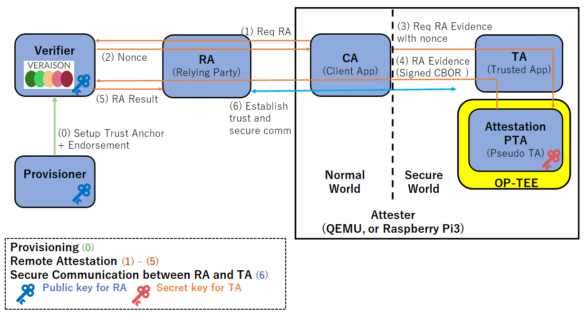

# OP-TEE Remote Attestation with VERAISON Verification.
<!--

認証 authentication
-->


This document explains how to set up the [OP-TEE](https://github.com/OP-TEE/optee_os) Remote Attestation and [VERAISON](https://github.com/veraison) Verification using QEMU and Docker containers.
It can run on Rasperry Pi 3B+  (Arm Cortex-A TrustZone).

The following figure shows the steps for provisioning (0), remote attestation (1)-(5), and secure communication (6).


## News

Current status is presented at [OpenSSF Day Tokyo 2025 (June/18 Wed @ Hilton Tokyo Odaiba)](https://events.linuxfoundation.org/openssf-community-day-japan/program/schedule/)

Current implementation and future work is presented at [FOSDEM 2025 Attestation Devroom](https://fosdem.org/2025/schedule/event/fosdem-2025-4952-remote-attestation-on-arm-trustzone-op-tee-with-veraison-verifier-current-status-and-future-plan-/)

The code for this remote attestation is merged at [OP-TEE](https://github.com/OP-TEE/optee_os/pull/7006)

## Prerequisites

To run the developed artifacts, you need to prepare an environment that meets the following requirements:

* Docker is installed
* Docker daemon is running
* Ensure that 30-40GB of disk space is available for Docker (you can check this with `docker system df`). If the available space is insufficient, it is recommended to free up space using `docker system prune --volumes --all`.
* `jq` is installed (on Ubuntu, you can install it with `sudo apt-get install jq`)

## Execution Method

Follow these steps from 0 to 6 to test the entire process of remote attestation.

For i.MX 8M Plus Yocto builds and real hardware attestation, see [step 8](#8-imx8mp-real-hardware-attestation) below. For QEMU-only Attester steps, see `attester/README.md`.

Note: i.MX 8M Plus loads `tee.bin` from `imx-boot` at the start of the SD card. The container build script rebuilds `imx-boot` and repacks the WIC image so changes to OP-TEE are reflected in the SD image.


### 0. Clone this GitHub repository
First, retrieve the source code for optee-ra by running git clone.

```
git clone https://github.com/iisec-suzaki/optee-ra
cd optee-ra
```


### 1. Starting the Services Provided by Veraison

Retrieve the Veraison source from GitHub.


```sh
git clone https://github.com/veraison/services.git
cd services && git checkout 8f5734c && cd ..
```

You may see the following message, but it is not a problem.
```
Note: switching to '8f5734c'.

You are in 'detached HEAD' state. You can look around, make experimental
changes and commit them, and you can discard any commits you make in this
state without impacting any branches by switching back to a branch.

If you want to create a new branch to retain commits you create, you may
do so (now or later) by using -c with the switch command. Example:

  git switch -c <new-branch-name>

Or undo this operation with:

  git switch -

Turn off this advice by setting config variable advice.detachedHead to false

HEAD is now at 8f5734c Yogesh's review comments
```

Next, start the services that will run on the host machine.
You can start Veraison with the following commands. Note that the startup process may take some time.
```sh
make -C services docker-deploy
```

After starting the services, you can check their status with the following command. If you are using zsh, execute `source services/deployments/docker/env.zsh` instead of `source services/deployments/docker/env.bash` .


```sh
source services/deployments/docker/env.bash
veraison status
```

If the Veraison services start successfully, you will get output similar to the following.

```txt
         vts: running
provisioning: running
verification: running
  management: running
    keycloak: running
```

### 2. Executing the Provisioning
Use the following commands to register the `trust anchor` and `reference value` with the Verifier. These values are used to verify the evidence sent by the Attester. If you want to change the values to be registered, modify the files under `provisoning/data`.

```sh
# QEMU (default)
./provisoning/run.sh qemu
# i.MX 8M Plus
./provisoning/run.sh imx
```

If you omit the argument, `qemu` is used.

You can check the registered values with the following command.
```sh
veraison stores
```

If the registration is successful, you will get the following output. This indicates the values registered with the Verifier.

```txt 
TRUST ANCHORS:
--------------
{
  "scheme": "PSA_IOT",
  "type": "trust anchor",
  "subType": "",
  "attributes": {
    "PSA_IOT.hw-model": "RoadRunner",
    "PSA_IOT.hw-vendor": "ACME",
    "PSA_IOT.iak-pub": "-----BEGIN PUBLIC KEY-----\nMFkwEwYHKoZIzj0CAQYIKoZIzj0DAQcDQgAEMKBCTNIcKUSDii11ySs3526iDZ8A\niTo7Tu6KPAqv7D7gS2XpJFbZiItSs3m9+9Ue6GnvHw/GW2ZZaVtszggXIw==\n-----END PUBLIC KEY-----",
    "PSA_IOT.impl-id": "cWVtdS1vcHRlZS1yYS0wMDAwMDAwMDAwMDAwMDAwMDE=",
    "PSA_IOT.inst-id": "AZDHHoAwT5jWVWpALAWTszqArL0I5K/5xAKfbhfhA5lR"
  }
}

ENDORSEMENTS:
-------------
{
  "scheme": "PSA_IOT",
  "type": "reference value",
  "subType": "PSA_IOT.sw-component",
  "attributes": {
    "PSA_IOT.hw-model": "RoadRunner",
    "PSA_IOT.hw-vendor": "ACME",
    "PSA_IOT.impl-id": "cWVtdS1vcHRlZS1yYS0wMDAwMDAwMDAwMDAwMDAwMDE=",
    "PSA_IOT.measurement-desc": "sha-256",
    "PSA_IOT.measurement-type": "ARoT",
    "PSA_IOT.measurement-value": "MbgFqjT4jfR+fK1O4YyQtZUYD0nhXh7GfhM0EmR6tgc=",
    "PSA_IOT.signer-id": "rLsRx+TaIXIFUjzkzhokWuGiOa48a/2eeHH35di66Gs="
  }
}
```

`TRUST ANCHORS` indicate the data used to verify the signature of the evidence sent by the Attester. The evidence sent by the Attester includes `impl-id` and `inst-id`, which the Verifier uses to identify which `TRUST ANCHOR` to use for verification. The Verifier uses the identified signature key (public key) to verify the evidence in CBOR(COSE) format.


* `iak-pub`: The public key used to verify the signature of the evidence (In this project, the ECDSA w/ SHA256 algorithm is used for signatures. This is because the generated evidence is in CBOR(COSE) format, which conforms to the specifications in [RFC 8152](https://datatracker.ietf.org/doc/html/rfc8152#section-8.1)).
* `impl-id`: The ID of the Attester
* `inst-id`: The ID of the public key


`ENDORSEMENTS` indicate the data (oracle) used to verify the content of the evidence sent by the Attester. The evidence sent by the Attester includes `impl-id` and `measurement-value`, which the Verifier uses to identify which `ENDORSEMENT` to compare with the received evidence. The Verifier compares the `measurement-value` recorded in the identified `ENDORSEMENT` with the `measurement-value` included in the received evidence to verify the correctness of the code hash value. For other items and more detailed information, please refer to the specification [Arm's Platform Security Architecture (PSA) Attestation Token](https://datatracker.ietf.org/doc/draft-tschofenig-rats-psa-token/).
* `impl-id`: The ID of the Attester
* `measurement-value`: The code hash value (In this project, the SHA256 of the TA code that calls the PTA)


### 3. Starting the Relying Party

Next, start the container for the Relying Party and run the application. The Relying Party receives requests from the Attester and mediates communication between the Attester and the Verifier. Additionally, when the Verifier sends the attestation results, the Relying Party outputs them to the log.
```sh
./relying_party/container/start.sh
```

If your verification service is not available at `https://verification-service:8080`, set `VERIFICATION_SERVICE_URL` before starting (default: `https://verification-service:8080`).
```sh
VERIFICATION_SERVICE_URL=https://verification-service:8443 ./relying_party/container/start.sh
```

You can check the logs of the Relying Party with the following command.

```sh
docker logs relying-party-service
```

If it starts successfully, you will get output similar to the following.

```txt
go build -o rp main.go
./rp
2024/02/22 05:17:54 Relying party is starting...
```

### 4. Starting the Attester

Next, start the Attester, which will send the attestation request. An environment to run the Attester on QEMU within the container is prepared. Follow these five steps to start the container and run the communication program with the Verifier.

#### 4.1. Starting the Container

Run the following command to enter the Docker container. Note that the initial execution may take some time to build the image, so it can take several minutes for the container to start.
```sh
./attester/container/start.sh
```

#### 4.2. Opening the Normal World Terminal

Open another terminal, separate from the one where you started the container in step 4.1, and execute the following command. This prepares a terminal to connect to the normal world of the Attester running on QEMU.

```sh
./attester/container/launch_soc_term.sh normal
```

#### 4.3. Opening the Secure World Terminal

Open another terminal, separate from the ones used in steps 4.1 and 4.2, and execute the following command. This prepares a terminal to connect to the secure world of the Attester running on QEMU.

```sh
./attester/container/launch_soc_term.sh secure
```

#### 4.4. Building User-Added CA/TA/PTA, Starting QEMU, and Logging In

In the terminal started in step 4.1, execute the following command to rebuild the user-added CA/TA/PTA and start QEMU. The container image already appends `subdirs-y += remote_attestation` to `/optee/optee_os/core/pta/sub.mk`, so no manual edit is needed.

```sh
make -C ${OPTEE_DIR}/build run CFG_REMOTE_ATTESTATION_PTA=y -j
```

Once QEMU has started, enter `c`.
```sh
(qemu) c
```

Next, log in as the `test` user on the normal world terminal (the terminal started in step 2).

```sh
buildroot login: test
```

### 4.5. Running the Program

The program is started on the normal world terminal.
To run the developed evidence generation program, use the following command.

```sh
optee_remote_attestation
```

If executed correctly, you will get the following output on the normal world terminal.

```txt
Opened new Veraison client session at http://relying-party-service:8087/challenge-response/v1/session/82e2edd9-0d53-11f1-9b92-393833646162

Number of media types accepted: 9
	application/psa-attestation-token
	application/eat+cwt; eat_profile="tag:psacertified.org,2023:psa#tfm"
	application/vnd.parallaxsecond.key-attestation.tpm
	application/eat-cwt; profile="http://arm.com/psa/2.0.0"
	application/eat-collection; profile="http://arm.com/CCA-SSD/1.0.0"
	application/vnd.parallaxsecond.key-attestation.cca
	application/eat+cwt; eat_profile="tag:psacertified.org,2019:psa#legacy"
	application/vnd.enacttrust.tpm-evidence
	application/pem-certificate-chain

Nonce size: 32 bytes
Nonce: [0xc4, 0x69, 0xd9, 0x7, 0x4, 0x87, 0xac, 0x71, 0x90, 0x30, 0x1f, 0x6d, 0x17, 0xbb, 0x62, 0x7c, 0x95, 0x8, 0x4f, 0x49, 0x2a, 0x5, 0x83, 0x1b, 0x3d, 0xde, 0x2a, 0x8f, 0x89, 0xd5, 0x41, 0x3c]

Completed opening the session.


Invoke TA.
Invoked TA successfully.


Received evidence of CBOR (COSE) format from PTA.

CBOR(COSE) size: 310
CBOR(COSE): d28443a10126a058eba71901097818687474703a2f2f61726d2e636f6d2f7073612f322e302e3019095a1a5f7cd29d19095b19300019095c582071656d752d6f707465652d72612d30303030303030303030303030303030303119095f81a3016441526f540258204237fb23701092316805005b86b2ab60f5ffb681e19e67d97a29e0939a04ea30055820acbb11c7e4da217205523ce4ce1a245ae1a239ae3c6bfd9e7871f7e5d8bae86b0a5820c469d9070487ac7190301f6d17bb627c95084f492a05831b3dde2a8f89d5413c19010058210190c71e80304f98d6556a402c0593b33a80acbd08e4aff9c4029f6e17e1039951584032935e3ebc3c2c052b7ec31fd8f22c4be5ad43cf21960db1de916d8a967bbae0bc1fa2dd110329cb3edeef1919beb74018fe7fbae99fab1743e024ec5f698150


Supplying the generated evidence to the server.

Received the attestation result from the server.

Disposing client session.

Completed sending the evidence and receiving the attestation result.
```

### 5. Performing Verification and Checking Results
Open another terminal and use the following command to check the logs of the relying party terminal.

```sh
docker logs relying-party-service
```

The attestation result is recorded in the `ear.status` field. If it is `affirming`, it means that the correct attestation result was obtained.

If you see `ear.status` as `warning` with a message like `executables not recognized`, the verifier still has old endorsements. In a shell where `env.bash` is sourced, clear the stores and re-run provisioning (use `imx` instead of `qemu` for the device).

```sh
veraison clear-stores
./provisoning/run.sh qemu
```

```txt
Attestation result:
[claims-set]
{
    "ear.verifier-id": {
        "build": "N/A",
        "developer": "Veraison Project"
    },
    "eat_profile": "tag:github.com,2023:veraison/ear",
    "submods": {
        "PSA_IOT": {
            "ear.appraisal-policy-id": "policy:PSA_IOT",
            "ear.status": "affirming",
            "ear.trustworthiness-vector": {
                "configuration": 0,
                "executables": 2,
                "file-system": 0,
                "hardware": 2,
                "instance-identity": 2,
                "runtime-opaque": 2,
                "sourced-data": 0,
                "storage-opaque": 2
            },
            "ear.veraison.annotated-evidence": {
                "eat-profile": "http://arm.com/psa/2.0.0",
                "psa-client-id": 1602015901,
                "psa-implementation-id": "cWVtdS1vcHRlZS1yYS0wMDAwMDAwMDAwMDAwMDAwMDE=",
                "psa-instance-id": "AZDHHoAwT5jWVWpALAWTszqArL0I5K/5xAKfbhfhA5lR",
                "psa-security-lifecycle": 12288,
                "psa-software-components": [
                    {
                        "measurement-type": "ARoT",
                        "measurement-value": "Qjf7I3AQkjFoBQBbhrKrYPX/toHhnmfZeingk5oE6jA=",
                        "signer-id": "rLsRx+TaIXIFUjzkzhokWuGiOa48a/2eeHH35di66Gs="
                    },
                    {
                        "measurement-type": "PRoT",
                        "measurement-value": "GEXvNatCVOIWXWTrDuDroAeUoynz136EUnSEp42BGhM=",
                        "signer-id": "rLsRx+TaIXIFUjzkzhokWuGiOa48a/2eeHH35di66Gs=",
                        "version": "4.6.0"
                    }
                ]
            }
        }
    }
}
[trustworthiness vectors]
submod(PSA_IOT):
Instance Identity [affirming]: The Attesting Environment is recognized, and the associated instance of the Attester is not known to be compromised.
Configuration [none]: The Evidence received is insufficient to make a conclusion.
Executables [affirming]: Only a recognized genuine set of approved executables, scripts, files, and/or objects have been loaded during and after the boot process.
File System [none]: The Evidence received is insufficient to make a conclusion.
Hardware [affirming]: An Attester has passed its hardware and/or firmware verifications needed to demonstrate that these are genuine/supported.
Runtime Opaque [affirming]: the Attester's executing Target Environment and Attesting Environments are encrypted and within Trusted Execution Environment(s) opaque to the operating system, virtual machine manager, and peer applications.
Storage Opaque [affirming]: the Attester encrypts all secrets in persistent storage via using keys which are never visible outside an HSM or the Trusted Execution Environment hardware.
Sourced Data [none]: The Evidence received is insufficient to make a conclusion.
```

> **OP-TEE OS version (the `PRoT` software component).** In addition to the
> `ARoT` component (which measures the Trusted Application), the evidence
> includes a second software component with `measurement-type` `"PRoT"` that
> reports the **OP-TEE OS version** in its `version` field (e.g. `"4.6.0"`), as
> shown above.
>
> The `measurement-value` is a runtime hash of the immutable core (`.text` +
> `.rodata`). It is **build-specific** (OP-TEE embeds the build timestamp in
> `core_v_str`, which is part of the hashed `.rodata`), so it changes whenever
> the OP-TEE OS is rebuilt — and the `PRoT` reference value therefore has to
> be (re-)registered for every released build. Compute it offline from the
> build artifact with
> [provisoning/compute-prot-refval.py](provisoning/compute-prot-refval.py)
> (no need to boot the image or raise the core log level):
>
> ```bash
> ./provisoning/compute-prot-refval.py path/to/tee.elf
> ```
>
> Put the printed `sha-256;...` digest into the `PRoT` measurement of
> `provisoning/data/comid-psa-refval-*.json` before provisioning. With the
> reference value registered the verifier checks the `PRoT` component like
> any other: a matching build keeps `ear.status` `affirming`, while a
> different OP-TEE build (or modified code) is flagged as `warning`. If no
> `PRoT` reference value is provisioned, the verifier ignores the component
> and `ear.status` is decided by the other components alone. Note: Yocto
> builds are reproducible (`SOURCE_DATE_EPOCH` is set and the build counter
> resets on clean builds), so rebuilding identical source does not change the
> reference value; QEMU container builds are not reproducible and need a
> fresh value per build.


### 6. Scenario for Sending Attestation Requests from Different TAs

So far, we have verified the flow of successful remote attestation. Next, we will check the scenarios where attestation requests from different TAs fail and where attestation is allowed by registering a new endorsement.

#### 6.1. Attestation Request from an Unregistered TA

First, we will verify the flow where remote attestation fails by sending a request to the PTA from an unregistered TA. For example, if you rewrite the `IMPLEMENTATION_ID` in [`attester/pta_remote_attestation/remote_attestation/remote_attestation.c`](attester/pta_remote_attestation/remote_attestation/remote_attestation.c), the code hash and implementation ID of the TA will change, and the content of the CBOR(COSE) evidence generated by the PTA will also change. As a result, since it differs from the provisioned data, attestation should fail.

```c
diff --git a/attester/pta_remote_attestation/remote_attestation/remote_attestation.c b/attester/pta_remote_attestation/remote_attestation/remote_attestation.c
--- a/attester/pta_remote_attestation/remote_attestation/remote_attestation.c
+++ b/attester/pta_remote_attestation/remote_attestation/remote_attestation.c
 /* Implementation ID used in PSA evidence */
-#define IMPLEMENTATION_ID     "qemu-optee-ra-000000000000000001"
+#define IMPLEMENTATION_ID     "qemu-optee-ra-000000000000000002"
```

Actually, after rewriting the code, send the attestation request. In the terminal where you started QEMU in step 4.4, press `ctrl+c` to exit QEMU. Then, follow step 4.4 again to rebuild the TA and restart QEMU.

After that, follow step 4.5 to send the attestation request, and follow step 5 to check the results. You will get an attestation result similar to the following. The `"ear.status": "contraindicated"` indicates that the attestation has failed.

```txt
2024/02/22 05:36:19 Received request: POST /challenge-response/v1/newSession?nonceSize=32
2024/02/22 05:36:19 Received response: 201 Created
2024/02/22 05:36:20 Received request: POST /challenge-response/v1/session/4e2f256e-d144-11ee-9588-623338313838
2024/02/22 05:36:20 Received response: 200 OK
2024/02/22 05:36:20 Attestation result: >> "/tmp/3383640462.jwt" signature successfully verified using "pkey.json"
[claims-set]
{
    "ear.verifier-id": {
        "build": "commit-b50b67d",
        "developer": "Veraison Project"
    },
    "eat_nonce": "J5um9vO4NYv8hYqPXUWsYuuWgW0TLV0qoZGQk3EnIUg=",
    "eat_profile": "tag:github.com,2023:veraison/ear",
    "iat": 1708580180,
    "submods": {
        "PSA_IOT": {
            "ear.appraisal-policy-id": "policy:PSA_IOT",
            "ear.status": "contraindicated",
            "ear.trustworthiness-vector": {
                "configuration": 99,
                "executables": 99,
                "file-system": 99,
                "hardware": 99,
                "instance-identity": 99,
                "runtime-opaque": 99,
                "sourced-data": 99,
                "storage-opaque": 99
            },
            "ear.veraison.policy-claims": {
                "problem": "no trust anchor for evidence"
            }
        }
    }
}
[trustworthiness vectors]
submod(PSA_IOT):
Instance Identity [contraindicated]: Cryptographic validation of the Evidence has failed.
Configuration [contraindicated]: Cryptographic validation of the Evidence has failed.
Executables [contraindicated]: Cryptographic validation of the Evidence has failed.
File System [contraindicated]: Cryptographic validation of the Evidence has failed.
Hardware [contraindicated]: Cryptographic validation of the Evidence has failed.
Runtime Opaque [contraindicated]: Cryptographic validation of the Evidence has failed.
Storage Opaque [contraindicated]: Cryptographic validation of the Evidence has failed.
Sourced Data [contraindicated]: Cryptographic validation of the Evidence has failed.
```

#### 6.2. Registering a New TA with Provisioning

First, check the code hash value of the new TA. Currently, when a request to generate evidence is sent to the PTA, the code hash value is output to the secure terminal for debugging purposes. Specifically, there is a line like the one below, where `gw9v98IV8ozl5nHpsMwl9W5nGGC0bzAYMPShwvff0vY=` is the base64 encoded value of the code hash.

```txt
D/TC:? 0 cmd_get_cbor_evidence:82 b64_measurement_value: gw9v98IV8ozl5nHpsMwl9W5nGGC0bzAYMPShwvff0vY=
```

Register this value with provisioning. To do this, modify the `digests` field in [`provisoning/data/comid-psa-refval-qemu.json`](provisoning/data/comid-psa-refval-qemu.json) as follows (use `provisoning/data/comid-psa-refval-imx.json` for i.MX 8M Plus).
Also, since the implementation ID has been changed to `qemu-optee-ra-000000000000000002`, modify the `psa.impl-id` fields in both [`provisoning/data/comid-psa-refval-qemu.json`](provisoning/data/comid-psa-refval-qemu.json) and [`provisoning/data/comid-psa-ta-qemu.json`](provisoning/data/comid-psa-ta-qemu.json) as follows. Note that the `psa.impl-id` field must register the base64 encoded value of the implementation ID. For example, you can calculate it with a command like `echo -n "qemu-optee-ra-000000000000000002" | base64`.

```txt
diff --git a/provisoning/data/comid-psa-refval-qemu.json b/provisoning/data/comid-psa-refval-qemu.json
index fd7965a..db675c1 100644
--- a/provisoning/data/comid-psa-refval-qemu.json
+++ b/provisoning/data/comid-psa-refval-qemu.json
@@ -22,7 +22,7 @@
           "class": {
             "id": {
               "type": "psa.impl-id",
-              "value": "cWVtdS1vcHRlZS1yYS0wMDAwMDAwMDAwMDAwMDAwMDE="
+              "value": "cWVtdS1vcHRlZS1yYS0wMDAwMDAwMDAwMDAwMDAwMDI="
             },
             "vendor": "ACME",
             "model": "RoadRunner"
@@ -39,7 +39,7 @@
             },
             "value": {
               "digests": [
-                "sha-256;MbgFqjT4jfR+fK1O4YyQtZUYD0nhXh7GfhM0EmR6tgc="
+                "sha-256;gw9v98IV8ozl5nHpsMwl9W5nGGC0bzAYMPShwvff0vY="
               ]
             }
           }
diff --git a/provisoning/data/comid-psa-ta-qemu.json b/provisoning/data/comid-psa-ta-qemu.json
--- a/provisoning/data/comid-psa-ta-qemu.json
+++ b/provisoning/data/comid-psa-ta-qemu.json
           "class": {
             "id": {
               "type": "psa.impl-id",
-              "value": "cWVtdS1vcHRlZS1yYS0wMDAwMDAwMDAwMDAwMDAwMDE="
+              "value": "cWVtdS1vcHRlZS1yYS0wMDAwMDAwMDAwMDAwMDAwMDI="
             },
             "vendor": "ACME",
             "model": "RoadRunner"
```

After that, follow step 2 to re-execute the provisioning. As a result, you will see that two `TRUST ANCHORS` and `ENDORSEMENTS` are registered, and you can confirm that only the `PSA_IOT.impl-id` and `PSA_IOT.measurement-value` parts are different.
```json
TRUST ANCHORS:
--------------
{
  "scheme": "PSA_IOT",
  "type": "trust anchor",
  "subType": "",
  "attributes": {
    "PSA_IOT.hw-model": "RoadRunner",
    "PSA_IOT.hw-vendor": "ACME",
    "PSA_IOT.iak-pub": "-----BEGIN PUBLIC KEY-----\nMFkwEwYHKoZIzj0CAQYIKoZIzj0DAQcDQgAEMKBCTNIcKUSDii11ySs3526iDZ8A\niTo7Tu6KPAqv7D7gS2XpJFbZiItSs3m9+9Ue6GnvHw/GW2ZZaVtszggXIw==\n-----END PUBLIC KEY-----",
    "PSA_IOT.impl-id": "cWVtdS1vcHRlZS1yYS0wMDAwMDAwMDAwMDAwMDAwMDE=",
    "PSA_IOT.inst-id": "AZDHHoAwT5jWVWpALAWTszqArL0I5K/5xAKfbhfhA5lR"
  }
}
{
  "scheme": "PSA_IOT",
  "type": "trust anchor",
  "subType": "",
  "attributes": {
    "PSA_IOT.hw-model": "RoadRunner",
    "PSA_IOT.hw-vendor": "ACME",
    "PSA_IOT.iak-pub": "-----BEGIN PUBLIC KEY-----\nMFkwEwYHKoZIzj0CAQYIKoZIzj0DAQcDQgAEMKBCTNIcKUSDii11ySs3526iDZ8A\niTo7Tu6KPAqv7D7gS2XpJFbZiItSs3m9+9Ue6GnvHw/GW2ZZaVtszggXIw==\n-----END PUBLIC KEY-----",
    "PSA_IOT.impl-id": "cWVtdS1vcHRlZS1yYS0wMDAwMDAwMDAwMDAwMDAwMDI=",
    "PSA_IOT.inst-id": "AZDHHoAwT5jWVWpALAWTszqArL0I5K/5xAKfbhfhA5lR"
  }
}

ENDORSEMENTS:
-------------
{
  "scheme": "PSA_IOT",
  "type": "reference value",
  "subType": "PSA_IOT.sw-component",
  "attributes": {
    "PSA_IOT.hw-model": "RoadRunner",
    "PSA_IOT.hw-vendor": "ACME",
    "PSA_IOT.impl-id": "cWVtdS1vcHRlZS1yYS0wMDAwMDAwMDAwMDAwMDAwMDE=",
    "PSA_IOT.measurement-desc": "sha-256",
    "PSA_IOT.measurement-type": "ARoT",
    "PSA_IOT.measurement-value": "MbgFqjT4jfR+fK1O4YyQtZUYD0nhXh7GfhM0EmR6tgc=",
    "PSA_IOT.signer-id": "rLsRx+TaIXIFUjzkzhokWuGiOa48a/2eeHH35di66Gs="
  }
}
{
  "scheme": "PSA_IOT",
  "type": "reference value",
  "subType": "PSA_IOT.sw-component",
  "attributes": {
    "PSA_IOT.hw-model": "RoadRunner",
    "PSA_IOT.hw-vendor": "ACME",
    "PSA_IOT.impl-id": "cWVtdS1vcHRlZS1yYS0wMDAwMDAwMDAwMDAwMDAwMDI=",
    "PSA_IOT.measurement-desc": "sha-256",
    "PSA_IOT.measurement-type": "ARoT",
    "PSA_IOT.measurement-value": "gw9v98IV8ozl5nHpsMwl9W5nGGC0bzAYMPShwvff0vY=",
    "PSA_IOT.signer-id": "rLsRx+TaIXIFUjzkzhokWuGiOa48a/2eeHH35di66Gs="
  }
}
```

After that, follow step 4.5 to send the attestation request, and follow step 5 to check the results. You will get an attestation result similar to the following. The `"ear.status": "affirming"` indicates that the attestation has been successful.

```json
[claims-set]
{
    "ear.verifier-id": {
        "build": "N/A",
        "developer": "Veraison Project"
    },
    "eat_nonce": "yBULiGEcBq8wtk5xwRikzPZt1GAV5n8L0nXgPY03jHo=",
    "eat_profile": "tag:github.com,2023:veraison/ear",
    "iat": 1708581024,
    "submods": {
        "PSA_IOT": {
            "ear.appraisal-policy-id": "policy:PSA_IOT",
            "ear.status": "affirming",
            "ear.trustworthiness-vector": {
                "configuration": 0,
                "executables": 2,
                "file-system": 0,
                "hardware": 2,
                "instance-identity": 2,
                "runtime-opaque": 2,
                "sourced-data": 0,
                "storage-opaque": 2
            },
            "ear.veraison.annotated-evidence": {
                "eat-profile": "http://arm.com/psa/2.0.0",
                "psa-client-id": 403236456,
                "psa-implementation-id": "cWVtdS1vcHRlZS1yYS0wMDAwMDAwMDAwMDAwMDAwMDI=",
                "psa-instance-id": "AZDHHoAwT5jWVWpALAWTszqArL0I5K/5xAKfbhfhA5lR",
                "psa-nonce": "yBULiGEcBq8wtk5xwRikzPZt1GAV5n8L0nXgPY03jHo=",
                "psa-security-lifecycle": 12288,
                "psa-software-components": [
                    {
                        "measurement-type": "ARoT",
                        "measurement-value": "gw9v98IV8ozl5nHpsMwl9W5nGGC0bzAYMPShwvff0vY=",
                        "signer-id": "rLsRx+TaIXIFUjzkzhokWuGiOa48a/2eeHH35di66Gs="
                    }
                ]
            }
        }
    }
}
```

### 7. Cleanup

You can stop the containers and other resources that were started for this test with the following commands.

```sh
make -C services really-clean
docker stop relying-party-service
docker network rm veraison-net
```

### 8. i.MX8MP Real Hardware Attestation

This section describes how to run PSA Remote Attestation on the i.MX8MP EVK
and verify the evidence with Veraison. Three scenarios are covered: the
embedded test key, CAAM black key generation, and CAAM black key conversion.

#### 8.0 Build and flash the i.MX8MP image (Yocto)

Requirements:
- Docker
- ~100GB free disk (first build)
- 4-8 hours for the first build

Build the full image (from repo root):
```bash
cd attester/container-imx
./yocto.sh
```

You can place Yocto workdirs on tmpfs for speed:
```bash
YOCTO_DIR=/dev/shm/yocto ./yocto.sh
```

Note: tmpfs builds may fail for some packages (e.g., `gdk-pixbuf-native`).
If that happens, use a normal filesystem.

Partial rebuilds:
```bash
./yocto.sh optee-os
./yocto.sh veraison-attestation
```

Note: i.MX8MP loads `tee.bin` from `imx-boot` at the start of the SD card.
`./yocto.sh optee-os` rebuilds `imx-boot`, but to update the WIC image for SD
flashing, run `./yocto.sh` (full) to repackage the image.

Output image:
```
${YOCTO_DIR}/build/tmp/deploy/images/imx8mpevk/core-image-minimal-imx8mpevk.rootfs.wic.zst
```

Flash the SD card:
```bash
cd ${YOCTO_DIR}/build/tmp/deploy/images/imx8mpevk/
zstd -d core-image-minimal-imx8mpevk.rootfs.wic.zst
sudo dd if=core-image-minimal-imx8mpevk.rootfs.wic of=/dev/sdX bs=4M status=progress && sync
```

Replace `/dev/sdX` with the actual SD card device.

#### Prerequisites

| Item | Details |
|------|---------|
| Board | i.MX8MP EVK |
| Build | `core-image-minimal` (Yocto + OP-TEE + veraison-attestation PTA) |
| Veraison | Docker deployment (`services/deployments/docker/`) |
| Network | Device and Veraison host must be IP-reachable |
| SD card | WIC image containing both imx-boot and rootfs |

> **Important**: i.MX8MP loads `tee.bin` from the imx-boot region at the start
> of the SD card, **not** from `/usr/lib/firmware/tee.bin` on the rootfs.
> PTA code changes require reflashing the WIC image (including imx-boot).

On the device, add the Veraison host to `/etc/hosts`:
```bash
echo "<Veraison_Host_IP> relying-party-service" >> /etc/hosts
```

On the Veraison host, start services and source the environment:
```bash
services/deployments/docker/veraison start
source services/deployments/docker/env.bash
```

#### Provisioning Helper: Computing Instance ID and PEM Public Key

For all scenarios, `instance-id = 0x01 || SHA-256(0x04 || PubX || PubY)`.
When using a CAAM key (Scenarios B and C), compute the instance ID and PEM
public key from the PubX/PubY coordinates on the host:

```bash
python3 -c "
import hashlib, base64
pub_x = bytes.fromhex('<PubX hex>')
pub_y = bytes.fromhex('<PubY hex>')
digest = hashlib.sha256(b'\x04' + pub_x + pub_y).digest()
instance_id = b'\x01' + digest
print('instance_id (base64):', base64.b64encode(instance_id).decode())
"
```

```bash
python3 -c "
from cryptography.hazmat.primitives.asymmetric import ec
from cryptography.hazmat.primitives import serialization
pub_x = bytes.fromhex('<PubX hex>')
pub_y = bytes.fromhex('<PubY hex>')
pub_numbers = ec.EllipticCurvePublicNumbers(
    x=int.from_bytes(pub_x, 'big'),
    y=int.from_bytes(pub_y, 'big'),
    curve=ec.SECP256R1()
)
pub_key = pub_numbers.public_key()
pem = pub_key.public_bytes(
    serialization.Encoding.PEM,
    serialization.PublicFormat.SubjectPublicKeyInfo
).decode()
print(pem.strip())
"
```

Then update the `instance` and `verification-keys` fields in
`provisoning/data/comid-psa-ta-imx.json` with the computed values.

#### 8.1 Scenario A: Embedded Test Key

The PTA signs evidence with a built-in ECDSA P-256 test key. No key
management is needed on the device side.

| Item | Value |
|------|-------|
| PubX | `30a0424cd21c2944838a2d75c92b37e76ea20d9f00893a3b4eee8a3c0aafec3e` |
| PubY | `e04b65e92456d9888b52b379bdfbd51ee869ef1f0fc65b6659695b6cce081723` |
| Instance ID | `AZDHHoAwT5jWVWpALAWTszqArL0I5K/5xAKfbhfhA5lR` |

**Provisioning**:
```bash
services/deployments/docker/veraison clear-stores
./provisoning/run.sh imx
```

The default `comid-psa-ta-imx.json` already contains the test key trust anchor.

**Attestation** (on device):
```bash
optee_remote_attestation
```

Expected result: `"ear.status": "affirming"`

#### 8.2 Scenario B: CAAM Black Key — Generate New Key

Generate a new hardware-protected ECDSA P-256 key pair using the CAAM module.
The private key is encrypted by JDKEK and never exposed in plaintext.

> **Note**: Black keys are encrypted with JDKEK (volatile). After a power
> cycle, JDKEK is regenerated and the key becomes unusable. Use the key
> within the same boot session.

**Step 1 — Generate** (on device):
```bash
optee_remote_attestation --generate-blackkey
```

Output:
```
Generating new black key...
BlackKey(hex): fbbfafca020000002000000...
PubX(hex): 3d87f38e7b34e5c0bc988becb225783daa4d14dc0031f49588fe61708c4f1f6f
PubY(hex): 15dc6990d4209e3cb1f732310a4784a535a93962b7d87274286026ec80153ce4
FullKey(hex): 3d87f38e7b34e5c0...fbbfafca020000002000000...
Black key generation completed.
```

**Step 2 — Provision** (on host): Compute instance ID and PEM public key
from PubX/PubY (see helper above), update `comid-psa-ta-imx.json`, then:
```bash
services/deployments/docker/veraison clear-stores
./provisoning/run.sh imx
```

**Step 3 — Attest** (on device): Pass the FullKey directly:
```bash
optee_remote_attestation --key-hex <FullKey hex>
```

Or pass components separately:
```bash
optee_remote_attestation --key-hex <BlackKey hex> --pubx-hex <PubX hex> --puby-hex <PubY hex>
```

Expected result: `"ear.status": "affirming"`

#### 8.3 Scenario C: CAAM Black Key — Convert Existing Key

Convert an existing plaintext ECDSA P-256 private key (32-byte `d` value)
into a CAAM black key. Use this when you already have a known key pair
(e.g., generated by OpenSSL).

**Step 1 — Convert** (on device):
```bash
optee_remote_attestation --convert-key <32-byte private key hex>
```

Output:
```
Converting plain key to black key...
BlackKey(hex): fbbfafca020000002000000...
Key conversion completed.
```

The public key (PubX/PubY) is not output because you already know it from
the original key pair.

**Step 2 — Provision** (on host): Compute instance ID and PEM public key
from your known PubX/PubY (see helper above), update `comid-psa-ta-imx.json`,
then:
```bash
services/deployments/docker/veraison clear-stores
./provisoning/run.sh imx
```

**Step 3 — Attest** (on device):
```bash
optee_remote_attestation --key-hex <BlackKey hex> --pubx-hex <PubX hex> --puby-hex <PubY hex>
```

Expected result: `"ear.status": "affirming"`

## Acknowlegement

This work was supported by JST, CREST Grant Number JPMJCR21M3 ([ZeroTrust IoT Project](https://zt-iot.nii.ac.jp/en/)), Japan.
