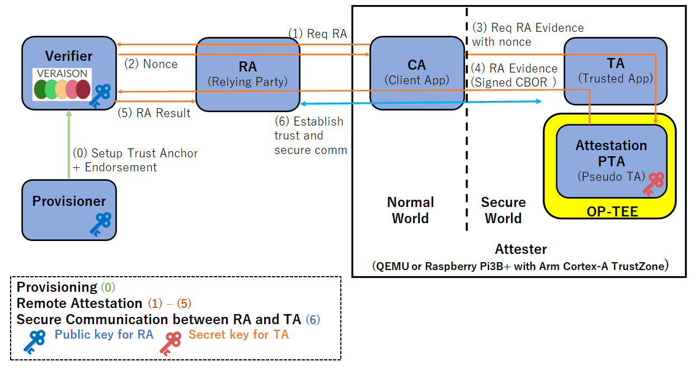

<!--
-------------------------------------------------------------------------------------------------------------------
-->
# 日本語解説 Relying Party

Relying Party は、TA(Trusted Application)を信頼してデータやサービス提供するためにTAを信頼したいサーバーです。
現在の実装ではAttester からのリモートアテステーションリクエストを受け、Attester と Verifier の間の通信を仲介する単純なプロキシサーバーです。



## 実行方法

以下のコマンドを実行すると、Relying Party 用のコンテナが起動します。
```sh
./container/start.sh
```

以下のコマンドを実行すると、そのコンテナのログが確認できます。　
```sh
docker logs relying-party-service
```

正しく起動できた場合、以下のようなログが得られます。
```txt
go build -o rp main.go
./rp
2024/02/20 01:39:16 Relying party is starting...
```
